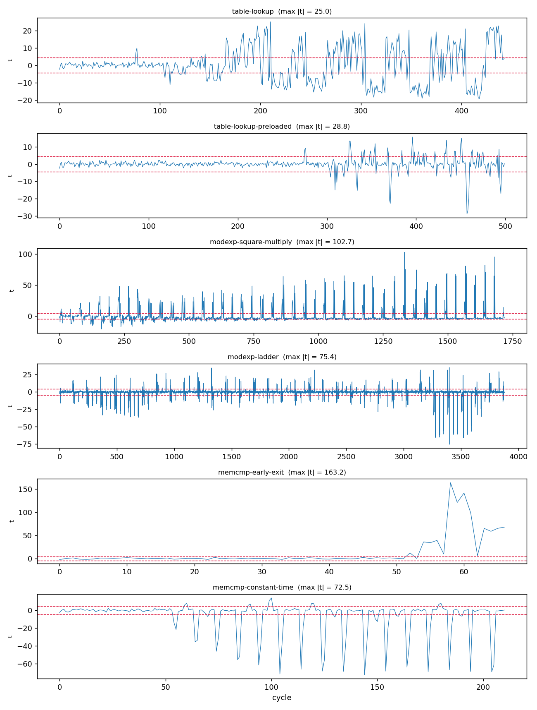
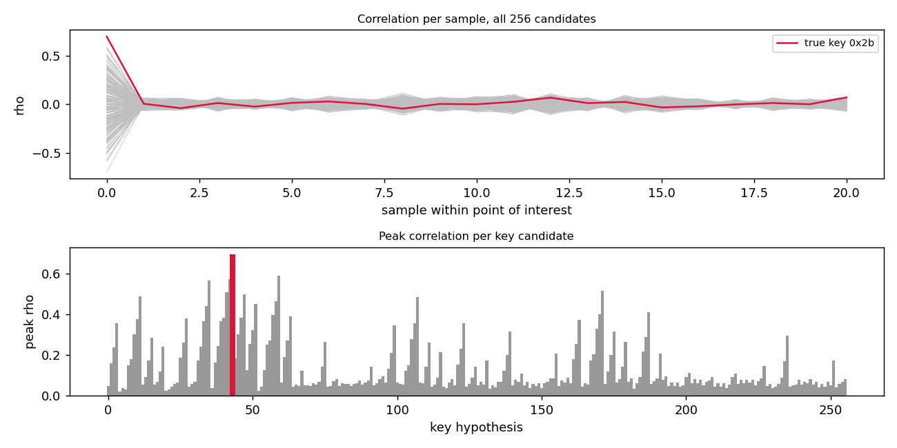

# Results

Generated by `scripts/reproduce.py`. Every figure and number below is
produced by that script on a fixed seed; re-running it reproduces this
file exactly. Do not edit by hand.


Configuration: default `ModelConfig` (4 KiB 4-way D-cache, 32 B lines, 20-cycle miss penalty, gshare, noise sigma = 1.0), 200 traces per TVLA group, 1000 traces for CPA.


## 1. Detector validation (false-positive control)

Fixed-vs-fixed: both groups use identical secrets and identical public
inputs, so there is no channel to detect. This runs first because every
negative result elsewhere depends on it.

```
no first-order leak detected: max |t| = 2.93 at sample 242 (threshold 4.5, 200+200 traces, 0 samples above threshold)
  |t| over 444 samples   peak=2.93   threshold=4.5
  ▄▅▃▃▆▅▄▄▅▄▃▅▂▅▄▅▄▆▄▃▄▆▃▂▅▇▄▄▄▄▆▄▆▅▄▆▃▄▅▃█▇▅▂▅▅▅▅▅▅▃▅▄▄▄▇▄▃▃▄▄▅▅▃▄▅▃▅▄▆▃▃▆▃▇▃▆▃
                                                                                
  0 sample(s) above threshold (marked ^)
```


## 2. Leakage detection across leaky/hardened pairs

| victim | class | power max \|t\| | timing | mean cycles fixed / random |
|---|---|---|---|---|
| table-lookup | leaky | 25.0 | LEAK | 444 / 427 |
| table-lookup-preloaded | hardened | 28.8 | constant | 500 / 500 |
| modexp-square-multiply | leaky | 102.7 | LEAK | 1720 / 1857 |
| modexp-ladder | hardened | 75.4 | constant | 3880 / 3880 |
| memcmp-early-exit | leaky | 163.2 | LEAK | 195 / 58 |
| memcmp-constant-time | hardened | 72.5 | constant | 211 / 211 |

The timing column separates the pairs exactly: every leaky victim is
flagged, every hardened victim is constant-time. The power column does
**not** separate them, and that is the substantive finding rather than a
shortcoming of the tool -- see the discussion in the README.





## 3. Attribution: which instruction leaks

```
victim         : memcmp-early-exit
traces         : 200 fixed + 200 random
alignment      : pad
power TVLA     : LEAK DETECTED: max |t| = 163.24 at sample 58 (threshold 4.5, 200+200 traces, 14 samples above threshold)
timing         : TIMING LEAK: t = 3043.44, mean cycles fixed = 195.0 vs random = 58.0, 3 distinct cycle counts observed
attribution    : leaking instruction addresses
                 pc=0x00000024  peak |t|= 163.24  share= 7.1%
                 pc=0x0000002c  peak |t|= 141.16  share= 7.1%
                 pc=0x00000028  peak |t|= 120.70  share= 7.1%
                 pc=0x00000030  peak |t|=  98.08  share=21.4%
                 pc=0x00000020  peak |t|=  67.57  share=14.3%

corresponding instructions:
  00000024: lbu    x6, 0(x6)
  0000002c: lbu    x7, 0(x7)
  00000028: add    x7, x11, x5
  00000030: bne    x6, x7, +12
  00000020: add    x6, x10, x5
```


## 4. Key recovery by correlation power analysis

```
Full-key recovery, 1000 traces, hd leakage model
  bytes recovered : 16/16
  recovered key   : 2b7e151628aed2a6abf7158809cf4f3c
  true key        : 2b7e151628aed2a6abf7158809cf4f3c
  worst-case traces to stable recovery: 150
  byte  true  best  rank   rho   margin  traces
     0  0x2b  0x2b     0  0.695   0.106      75
     1  0x7e  0x7e     0  0.645   0.102     150
     2  0x15  0x15     0  0.570   0.067     100
     3  0x16  0x16     0  0.563   0.106      50
     4  0x28  0x28     0  0.578   0.100     100
     5  0xae  0xae     0  0.530   0.071     125
     6  0xd2  0xd2     0  0.495   0.073     125
     7  0xa6  0xa6     0  0.532   0.069     150
     8  0xab  0xab     0  0.595   0.099      50
     9  0xf7  0xf7     0  0.607   0.099     100
    10  0x15  0x15     0  0.576   0.065      50
    11  0x88  0x88     0  0.564   0.095      75
    12  0x09  0x09     0  0.600   0.074     100
    13  0xcf  0xcf     0  0.565   0.095      50
    14  0x4f  0x4f     0  0.600   0.088      75
    15  0x3c  0x3c     0  0.546   0.081      25
```




## 5. Ablations: why the defaults are the defaults

Each row disables one part of the analysis. These are failure modes the
tool would otherwise hide, so they are asserted in the test suite.


### 5.1 Without attribution-guided point-of-interest selection

```
CPA on key byte 0 [hd model]: not recovered
  true key         : 0x2b
  best candidate   : 0x00 (rho = 0.942)
  runner-up rho    : 0.720 (margin 0.223)
  rank of true key : 9
  complement tie   : present (resolved by signed ranking)
  traces to stable recovery: > 1000 of 1000
```

The plaintext load earlier in the loop body leaks HW(p) directly, which
correlates maximally with the hypothesis for candidate 0x00 regardless of
the real key. A textbook ghost peak.


### 5.2 With a mismatched leakage model (HW against an HD bus)

| byte | true key | HW-model best | rank of true key |
|---|---|---|---|
| 0 | 0x2b | 0x2b | 0 |
| 1 | 0x7e | 0x7f | 3 |
| 2 | 0x15 | 0x17 | 1 |
| 3 | 0x16 | 0x15 | 13 |

The returned candidates sit a Hamming step or two from the true key. The
attack is not failing randomly -- it is succeeding against the wrong model.


## 6. Attack cost versus measurement noise

| noise sigma | bytes recovered | worst-case traces to stable recovery |
|---|---|---|
| 0.5 | 16/16 | 150 |
| 1.0 | 16/16 | 150 |
| 2.0 | 16/16 | 200 |
| 4.0 | 16/16 | 600 |
| 8.0 | 15/16 | 950 |

Trace count required grows with sigma, as the standard CPA analysis
predicts. This sweep is the closest the tool comes to a quantitative
security claim, and it is a claim about the model, not about silicon.


---

Generated in 27.9 s.

